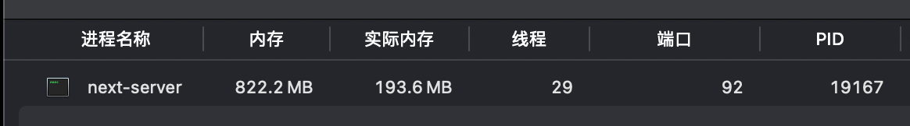
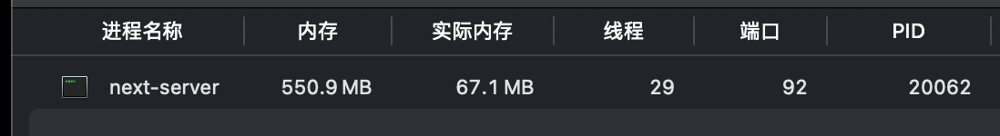

# ssr-optimize

通过`mock`某些不需要在`server`导入的依赖，优化 `next.js` `dev/build` 性能。

## 安装

```
pnpm i ssr-optimize -D
# or
npm i ssr-optimize -D
# or
yarn add ssr-optimize -D
# or
bun add ssr-optimize -D
```

## 配置

```js
// next.config.mjs
const { withSSROptimize } = require("ssr-optimize");

/** @type {import('next').NextConfig} */
const nextConfig = {};

module.exports = withSSROptimize({
  deps: {
    // 添加想要 mock 的依赖
    // key 会设置为 webpack.resolve.alias 的 key
    // value 是 mock 实现的路径，true 则使用默认的 mock 实现，见 `src/mock.js`
    // eg:
    ethers: true,
    "@web3modal/ethers$": true,
    "@web3modal/ethers/react": true,
  },
})(nextConfig);
```

## 实现原理

**举个例子**：

在某个页面需要调用依赖`a`，但是`a`不会在`server`中运行，运行`a`可能是在`onClick`中，或者某些强依赖`browser`的环境中。

那么此时对于`server bundle`来说，导入`a`就是多余的。

如果`a`的代码量非常大、模块数量非常多或者有很多`a`独有的依赖。势必会降低`server` 构建的性能以及可能的 `server` 运行的性能。

详见 `example/next-js`。

在这个例子中，我们使用了 `@web3modal/ethers` 和 `ethers`，但是这两个依赖并不会在服务端运行，他们依赖的`browser`。

所以我们可以尝试`mock`这两个依赖的导出，使得业务代码不用做任何更改，同时优化`server`端的性能。

### 如何 mock

通过指定`webpack.resolve.alias`来 mock 依赖。

例如：

在 server 构建时候，webpack 解析到如下代码：

`import { createWeb3Modal } from "@web3modal/ethers/react"`时。

通过 `webpack.resolve.alias` 指定 `@web3modal/ethers/react` 为 `src/mock.js`，
使其真正参与编译的时候被替换为 `src/mock.js`的实现。

#### 默认 mock 实现
详见 `src/mock.js`

## 对比

这里给出部分对比数据，感兴趣可以运行 `example/next-js` 查看。

### next dev

**module count**

- 常规 
- 优化 

访问同一页面`next`构建的`module`数量有所下降，即在`server`端没有去构建`@web3modal/ethers`和`ethers`。

**memory usage**

冷启动后

- 常规 
- 优化 

热更新多次后

- 常规 
- 优化 

### next build

通过运行 `node --heap-prof ./node_modules/next/dist/bin/next build` 生成的 `heapprofile` 获取的内存数据

**memory usage**

- 常规 
- 优化 

**bundle-analyzer**

- 常规 
- 优化 

**总结**
从以上对比数据来看，`mock`掉在`server`中用不上的依赖确实能带来有效的性能提升。
